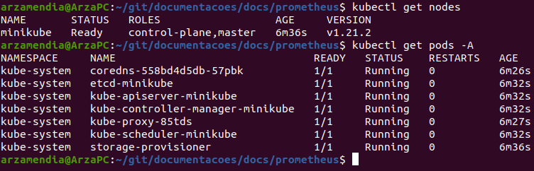

# Monitoramento com Prometheus

Existem várias formas de se monitorar um cluster Kubernetes. Temos plataformas pagas como o [Dynatrace](https://www.dynatrace.com/) ou o [Datalog](https://www.datadoghq.com/) que hospedam as suas métricas na nuvem e gerenciam a infraestrutura necessária de forma automática. Existem também plataformas gratuitas e open source que podem ser instalados localmente, deixando todo o gerenciamento por sua conta.
 
Entre as principais plataformas de monitoramento disponíveis gratuitamente, a comunidade costuma considerar o Prometheus como o padrão de monitoramento de cluster Kubernetes on premise e em nuvem.

Além disso, quando tratamos de projetos (não plataformas) open source, o Prometheus brilha. O protocolo [OpenMetrics](https://github.com/OpenObservability/OpenMetrics/blob/main/specification/OpenMetrics.md), criado como uma forma de padronizar o formato de exportação de metricas usado pelo Prometheus é muito difundido na comunidade. Mesmo em aplicações que não tem suporte a exportar métricas no formato do Prometheus, facilmente conseguimos encontrar extensões ou exporters que podem ser incluídas no sistema, adicionando o suporte.

Junto com isto, criar e editar gráficos e dashboards no Grafana (O visualizador de métricas natural do Prometheus) é extremamente fácil e intuitivo. Além disso, existem provavelmente milhares de dashboards compartilhados na internet para todo tipo de aplicação.

## Prometheus no Minikube

Dado esta introdução, vamos demonstrar a instalação de um ambiente de monitoramento de um Kubernetes, não falarei cluster, pois usaremos um Minikube com apenas um nó. Caso você queira testar também, os seguintes requisitos são necessários:

- Minikube
- Helm


Não abordarei a instalação deles neste documento, então antes de seguir os próximos pontos, prepare-os de forma adequada em sua estação de trabalho.

Caso você instale o Kubernetes em servidores diferentes de sua estação de trabalho, é importante que você execute os comandos de "port-forward" direto de sua estação. Caso isto não seja possível, você teria que customizar estes comandos para conseguir acessar os recursos de seu cluster ou prover outros métodos.

## Iniciando o Minikube

O Minikube, em meu caso, usará o Docker de minha estação para criar nosso ambiente de testes. Em alguns casos ele pode usar VM's em um hypervisor ou coisas parecidas. De qualquer, ele irá tratar de preparar a integração entre nosso kubectl local e o cluster K8S.

Então vamos lá, para iniciar o ambiente execute:

```
minikube start

```


Com nosso ambiente iniciado, podemos verificar se tudo está OK rodando alguns comandos:

```
kubectl get nodes
```

Que nos retornará uma lista com os nodes de nosso cluster.

```
kubectl get pods -A
```

Que nos retornará os pods de todos os Namespaces.

Algo parecido com isso será retornado...




## Prometheus Chart

Para simplificar a instalação de ambientes de monitoramento de clusters Kubernetes usando Prometheus, um [Chart](https://github.com/prometheus-community/helm-charts/) foi criado.

Com ele, iremos implementar toda a infraestrutura necessária para uma instalação padrão do Prometheus, Grafana, Node Exporter, Metric Server e Alert Manager. O ambiente ainda não estará pronto para produção, porém será possível testar praticamente todas as características do ambiente.

Começaremos criando um namespace para abrigar todos os objetos criados pelo Operator:

```
kubectl create namespace prometheus
```
Após isso, adicionaremos o repositório do chart em nosso ambiente e o instalaremos no namespace que criamos.

```
helm repo add prometheus-community https://prometheus-community.github.io/helm-charts
```

```
helm install prometheus prometheus-community/kube-prometheus-stack --namespace prometheus

```

Algo assim deve ser retornado, eu removi os Warnings de API’s descontinuadas para facilitar!


O processo de instalação demora alguns minutos. Podemos usar um comando para verificar a instalação. Ao final o ambiente deve ficar da seguinte forma:

```
kubectl get pods -n prometheus

```


De maneira simplificada, cada um desses pods tem a seguinte finalidade: 
 
 - Alertmanager: Gerenciador de alertas do ambiente.
 - Grafana: Frontend onde veremos os gráficos.
 - Prometheus-Operator: Gerenciador da instalação.
 - Kube-State-Metrics: Expõe as métricas dos recursos internos do Kubernetes
 - Prometheus: Quem irá capturar e guardar as métricas.
 - Node-Exporter: Expõe as métricas dos servidores.

## Instalação pronta, e agora?

Com a finalização da instalação do Prometheus (e outros recursos) em nosso cluster, podemos acessá-lo com os seguintes comandos:

```
kubectl port-forward -n prometheus service/prometheus-operated 9090:9090
```

Após isto, podemos acessar no navegador de nossa estação de trabalho em: http://localhost:9090 e verificar a interface web do Prometheus!


Certo, tudo certo com o Prometheus, agora vamos acessar o Grafana. Com o seguinte comando podemos acessá-lo:

```
 kubectl port-forward -n prometheus service/prometheus-grafana 3000:80
```

Agora podemos acessar http://localhost:3000 para ter acesso ao Grafana! As credenciais de acesso são: admin/prom-operator.


Caso o projeto evolua (o que é bem possível) e elas sejam alteradas, é possível recuperá-las através da secret criada no ambiente:

```
kubectl get secret -n prometheus prometheus-grafana -o yaml
```
A secret guarda o usuário e a senha em base64, basta decodificar os valores para ter acesso a senha do ambiente.


## Dashboards

O ambiente já vem com vários dashboards prontos. Eles podem ser acessados [aqui](http://localhost:3000/dashboards).


Não trataremos disso nesse documento, mas é fácil exportar partes interessantes de um dashboard e agregá-los todos em um único dashboard de gerenciamento. O Grafana também tem funções de criar playlists de Dashboards para deixarmos rodando em um monitor separado.

O Grafana é uma aplicação bem completa. Podemos configurá-lo para usar autenticação via LDAP, configurar alertas via Slack ou Mattermost e adicionar outras fontes de dados. Além disso, existem vários plugins para customizar ainda mais o ambiente. Nesta [página](https://grafana.com/grafana/dashboards) podemos encontrar dashboards oficiais e da comunidade para download.

## Sobre clusters

Estes procedimentos podem ser utilizados em ambientes com mais de um node. O Node-Exporter é implementado de forma a ter um pod iniciado em cada servidor do cluster, sendo assim, as métricas de todos os servidores serão coletadas.

Os dados serão persistidos por 10 dias, porém da forma atual, caso o pod do Prometheus reinicie, todas as métricas serão perdidas. Isso pode ser resolvido de algumas formas, porém não trataremos disso nesse documento.

## Palavras finais

Por mais que este ambiente a princípio pareça completo, ainda faltam algumas coisas para realmente o colocarmos em produção. Será necessário prover o acesso a pessoas fora do cluster pelo menos ao Grafana. Temos que emitir certificados digitais para as URLs externas e gerenciar a persistência de dados do Prometheus, afinal não queremos perder nossas métricas.

Além disto, o ambiente está com suas definições padrões, então teremos que observar nossas necessidades para alterar coisas como tempo de retenção, formas de autenticação e canais de alertas. Isso tudo pode ser feito no decorrer do tempo, conforme aprendemos melhor como usar este ambiente.

Essas customizações podem ser feitas durante a instalação do ambiente usando o Chart do Helm. Em geral usa-se um arquivo chamado "values.yaml" em conjunto com o comando de instalação:

```
helm install prometheus prometheus-community/kube-prometheus-stack -f values.yaml --namespace prometheus

```

Este arquivo pode ser encontrado [aqui](https://github.com/prometheus-community/helm-charts/blob/main/charts/kube-prometheus-stack/values.yaml) com seus valores padrões. 

### Remoção do ambiente

Caso você queira remover a instalação, isso pode ser feito com o comando:


```
helm uninstall prometheus -n prometheus

```

Por algum motivo, o helm não remove alguns Custom Resources criados durante a instalação. Verifique isso caso delete o ambiente!

E o cluster de Kubernetes gerido pelo Minikube pode ser deletado com:

```
minikube delete

```

Então é isso, assim encerro este documento, onde tratamos de alguns aspectos do Prometheus no Kubernetes. Entrem em contato caso encontrem algum erro neste documento ou queiram mostrar algo interessante sobre esse ambiente!

